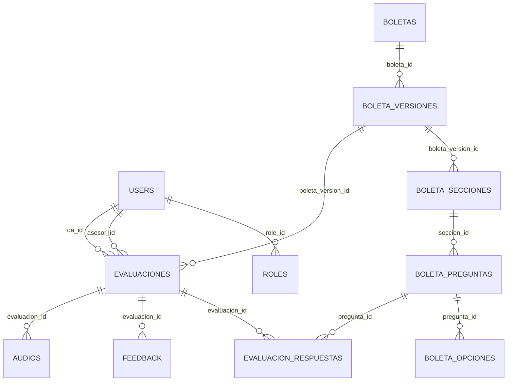
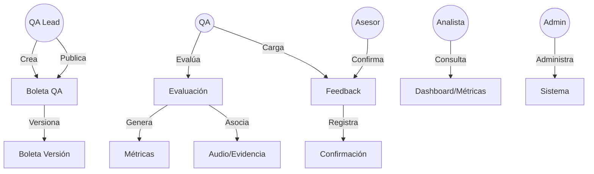
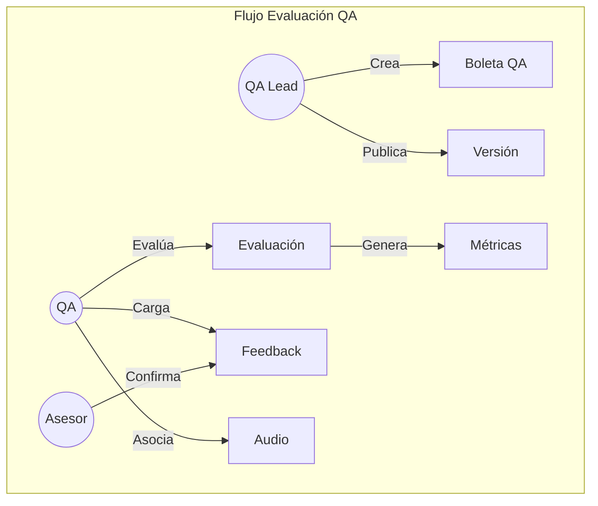
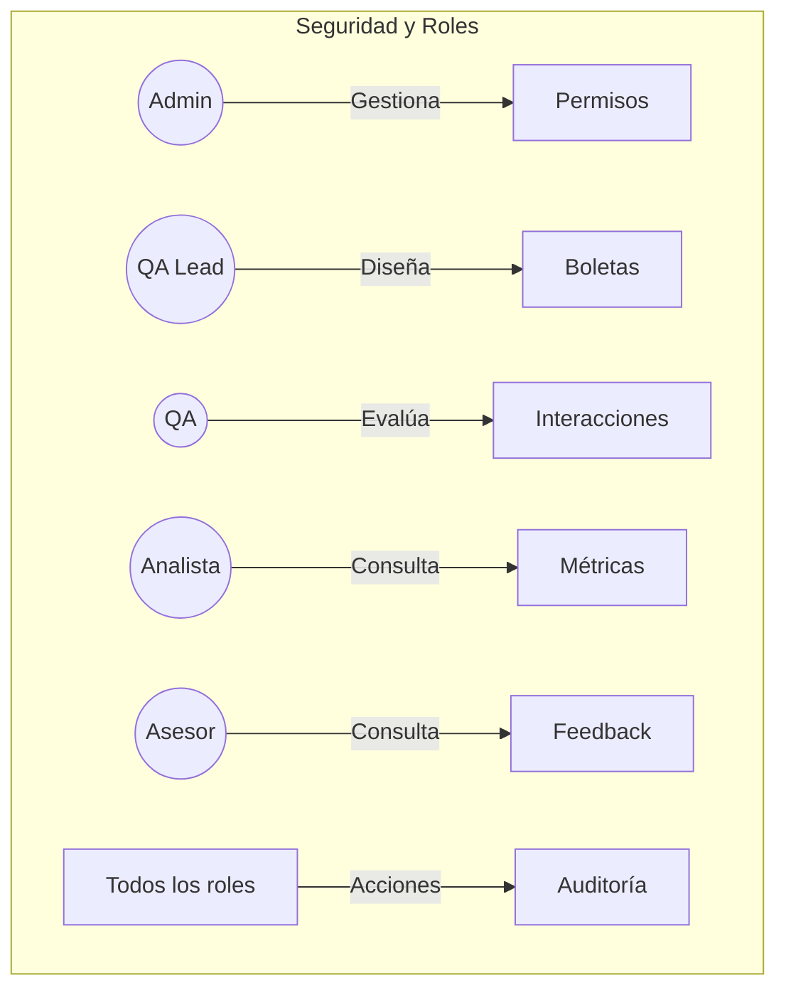

# Diagrama ER Visual (Mermaid)



# Diagrama de Casos de Uso



# Diagrama de Arquitectura General

```mermaid
flowchart TD
  subgraph Backend (Laravel)
    A1[API REST]
    A2[Autenticación JWT/Sanctum]
    A3[Servicios y Controladores]
    A4[Base de datos MySQL]
  end
  subgraph Frontend (Angular)
    B1[Login]
    B2[Dashboard]
    B3[Boletas]
    B4[Evaluaciones]
    B5[Feedback]
    B6[Métricas]
    B7[Usuarios]
  end
  B1 -->|API| A1
  B2 -->|API| A1
  B3 -->|API| A1
  B4 -->|API| A1
  B5 -->|API| A1
  B6 -->|API| A1
  B7 -->|API| A1
  A1 -->|DB| A4
  B1 -->|Guards| B7
  B2 -->|Guards| B7
```

# Diagrama de Flujo de Evaluación QA



# Diagrama de Seguridad y Roles


